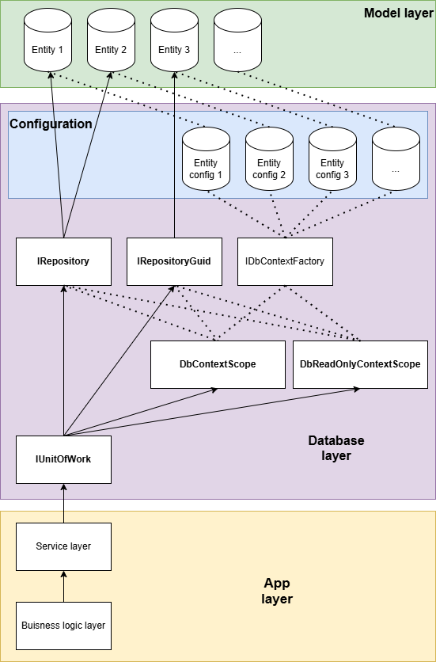
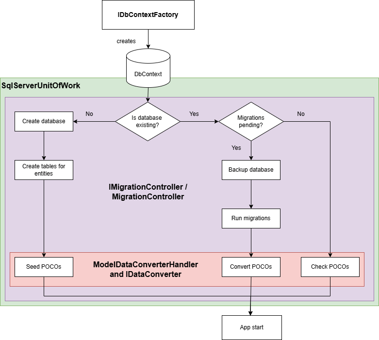

Bodoconsult.Database.Ef
==============

# What does the library

Bodoconsult.Database.Ef is a library based on Microsoft Entity Framework Core (EFCore). EFCore is an object-relational-mapper (ORM) bringing the relational database model together with object ortiented programming languages.


# How to use the library

The source code contains NUnit test classes the following source code is extracted from. The samples below show the most helpful use cases for the library.

>   [Overview](#overview)

>   [Entities](#entities)

>   [Entity configuration](#entity-configuration)

>   [Database context](#database-context)

>   [Enhance database context for target database type](#enhance-database-context-for-target-database-type)

>   [Create a DbContext factory](#create-a-dbcontext-factory)

>   [Create a unit of work based on SqlServerUnitOfWork](#create-a-unit-of-work-based-on-sqlserverunitofwork)

>   [Handling evolving database schemas: Migrations](#handling-evolving-database-schemas-migrations)

> > [Overview migrations](#overview-migrations)

> > [Entity Framework Core tools (EFCore tools)](#entity-framework-core-tools-efcore-tools)

> > [Existing databases](#existing-databases)

> > [Example for EfCore migrations followed by a data migration](#example-for-efcore-migrations-followed-by-a-data-migration)

> > [Create model data converters: BaseModelDataConverter](#create-model-data-converters-basemodeldataconverter)

> > [Create a model data conversion handler factory: IModelDataConvertersHandlerFactory](#create-a-model-data-conversion-handler-factory-imodeldataconvertershandlerfactory)

> > [Running schema and data migrations: IMigrationController](#running-schema-and-data-migrations-imigrationcontroller)

> > []()

> > []()

# Overview

Bodoconsult.Database.Ef is intended to work as a separation layer between EFCore database layer and database service layer. The main classes IUnitOfWork, DbContextScope, DbReadOnlyScope, IRepository and IRepositoryGuid hide the EFCore specific implementations behind a general abstraction implementable for other database technologies too. This makes using the database layer easier to use for people with limited skills in EFCore.

To abstract database layer may be a good idea especially if you have EFCore changing history in mind. MS restarted EF already multiple times with nearly always fully incompatible codebases causing a lot of migration work at their customers side. This is a reason some companies and developers are not eager to work with EFCore.

Most examples you will find for EFCore are based on code-first access to EFCore. If you have to migrate legacy databases at customer side already working you will the database-first access to EFCore. These real world cases are generally much more complex then code-first but EFCore may add additional complexity.

## Points you should know before using EFCore

To employ EFCore in a database project should be an explicit and well defined decision. If your project may gets more complex and is potentially holding more data in the database data this decision can be crucial for the success of the projects.

Our experience as a rule of thumb is the more complex and the more data a database potentially contains the more crucial is performance and the more critical is the usage of EFCore. 

There are alternatives for EFCore: You can use another ORM mapper like lightweight Dapper or you doing the mapping manually yorself based System.Data classes like DataTable and DataReader. The later might lead to the most performant code but is the most time consuming developing way.

Advantages of EFCore are

-   Entities are typesafe allowing better code quality.

-   Loading entities is easier for the developer than to hard code it with basic System.Data classes like DataTable and DataReader.

-   Use of LINQ and similar technologies simplifies code developement

-   EFCore is usable with a lot of different database like SqlServer, Oracle, MySql, Sqlite etc.

Disadvantages of EFCore are:

-   Loading an entity with EFCore means basically loading all properties from the database only if there is needed only one property of the entity. There are workarounds that but they are time consuming to implement and therefore weakening the advantages of EFCore.

-   EFCore SQL generation may created highly complex and bad performing SQL code from LINQ queries

-   Performance drawbacks due to additional EFCore internal loading of entities from database especially in default untracked mode when saving updated data. Up to EFCore 3.1. the tracked mode was default. This means EFore tracks the changes made at a entity internally until entity is saved to database again. This default setting didn't help in many real life scenarios where the data are given i.e. to a GUI client via a non-EFCore technology like GRPC and given back to EFCore later in an updated state same way. Nowadays loading entities is done by EFCore is done in untracked mode by default.

-   EFCore is an additonal layer requiring a lot of ressources compared to plain SQL. This might be an issue for bigger data management processes like data migrations. In such cases you have to weight typesafety and unit testability against performance.

## Recommened layers for database access in an app

In the following documentation we use the following (uncomplete) layer model of an app:

-   **Business logic layer**: Implements business logic but no database details. The database is access only via Database service layer.

-   **Database service layer**: Implements database access logic based on System.Data, EFCore, Dapper etc.

-   **Database layer**: This layer is not urgently needed but simplifies the access to EFCore in Bodoconsult.Database.Ef. It provides general functionality frequently used generally like basic connection handling or entity related actions like adding, updating, deleting and selecting entities in an generic manner. Its usage simplifies the database service layer code.

-   **Model layer**: Defines the entities (tables) used in the database.


## Database layer seen from database service layer

The business logic layer should not access the database layer directly. A direct access to database layer weakens replaceablility and testability of the business logic layer.

To use the database layer from database service layer you normally need the following classes:

-   **IUnitOfWork**: The central class providing database service access.

-   **DbContextScope** and **DbReadOnlyScope**: This both classes represent the database connection and all its configuration required for EFCore. To access entities in the database you need to have a valid instance of one of those classes. Use IuniOfWork.GetContextScope() and IUnitOfWork.GetReadOnlyContextScope() to get this instances.

-   **IRepository** and **IRepositoryGuid**: Use both interfaces for accessing data from entity tables, update data in the tables etc. Use IUnitOfWork.GetRepository<TEntity> and IUnitOfWork.GetRepositoryGuid<TEntity> to access data from a certain entity type TEntity.

The following code shows the basic idea of getting data from a table readonly:

``` csharp
// Read data from database
using (uow.GetReadOnlyContextScope())   // Opening connection and closing it on Dispose() of uow
{
    var repo = uow.GetRepository<Users>();
    var result = repo.Any(x => x.UserTypeId > 0);
    Assert.That(result, Is.True);
}
```

The following code shows the basic idea of adding a row to a table. Updating, deleting and selecting entities data are done similar.


``` csharp
// Write data to database
using (uow.GetReadOnlyContextScope())   // Opening connection and closing it on Dispose() of uow
{
    var repo = uow.GetRepository<Users>();
    
    var newEntity = new Users():
    newEntity.Name = "Blubb";

    repo.Add(newEntity);    

    scope.SaveChanges();
}
```

The following chart shows the intended (uncomplete) database related layering of an app using Bodoconsult.Database.Ef:



## Process of setting up the database context

The unit of work should be loaded as a singleton instance on app start. During instanciation the DbContext is created, the necessary migrations are executed and if needed existing data are migrated or a fresh database is seeded.




# Entities 

If talking about Entity Framework an entity is a simple class representing a table in the database. Sometimes entities are named *plain old code objects* (POCO) too.

``` csharp
/// <summary>
/// Represents an app setting item
/// </summary>
public class AppSettings : IEntityRequirements
{
    public int ID { get; set; }

    /// <summary>
    /// Row version to solve concurrency issues
    /// </summary>
    public byte[] RowVersion { get; set; }

    /// <summary>
    /// The key name of the app setting
    /// </summary>
    [Required(AllowEmptyStrings = false)]
    [StringLength(255)]
    public string Key { get; set; }

    /// <summary>
    /// Current value of the app setting
    /// </summary>
    public string Value { get; set; }
}
```

Do not use prefixes for entities. It is not recommend by MS anymore. In the above example name the class AppSettings instead of TAppSettings

Entities used with Entity Framework should contain simple get-set properties only. There should not be implemented any kind of logic in an entity. 
If you want to enhance an entity with logic used extension methods for implementing the logic:

``` csharp
/// <summary>
/// Extension method for <see cref="AppSettings"/> entity
/// </summary>
public static class AppSettingsExtensions
{
    /// <summary>
    /// Returns the entity data as a friendly readable string
    /// </summary>
    /// <param name="appSettings">Current entity instance</param>
    /// <returns>Entity data as a friendly readable string</returns>
    public static string ToFormattedString(this AppSettings appSettings)
    {
        return $"{appSettings.Key}: {appSettings.RowVersion}";
    }
}
```

If logic is implemented in the entity class itself, the logic is loaded to memory per instance created of the entity type. The extension method is loaded only once. Espacially for heavy-usage entities is may reduce the memory pressure of your app.

# Entity configuration

Entity configuration for entity properties may be done in the entity class itself via attributes like [Required(AllowEmptyStrings = false)] in the above sample.

More and more complex configuration can be done in a separate configuration file implementing IEntityTypeConfiguration\<T\>. Use this file to configure table details, database indexes and other more sophisticated settings.

``` csharp
/// <summary>
/// Entity configuration for <see cref="AppSettings"/> entity
/// </summary>
public class AppSettingsConfig : IEntityTypeConfiguration<AppSettings>
{

    public void Configure(EntityTypeBuilder<AppSettings> builder)
    {
        if (builder == null)
        {
            throw new ArgumentNullException(nameof(builder));
        }


        builder.HasKey(x => x.ID);
        builder.ToTable("AppSettings");
        builder.Property(x => x.ID).ValueGeneratedOnAdd();

        builder.Property(e => e.Key)
                .HasMaxLength(255)
                .IsRequired();

        builder.Property(p => p.RowVersion).IsRowVersion().IsConcurrencyToken().IsRequired();

        builder.HasIndex(u => u.Key)
            //.HasName("AppSettingsKeyUnique") // Old
            .HasDatabaseName("AppSettingsKeyUnique") // New
            .IsUnique();
    }
}
```

# Database context

Implement a base DbContext based class:

``` csharp
public class ExampleDbContext : Microsoft.EntityFrameworkCore.DbContext
{

    /// <summary>
    /// Default ctor
    /// </summary>
    public ExampleDbContext() : base(GetDefaultOptions())
    { }

    /// <summary>
    /// Ctor for setting up DbContext with a specific connection string
    /// </summary>
    /// <param name="connectionString">Connection string</param>
    public ExampleDbContext(string connectionString) : base(GetDefaultOptions(connectionString))
    { }

    /// <summary>
    /// Ctor for setting up DbContext with non SqLserver database i.e. for in-memory testing
    /// </summary>
    /// <param name="options">DbContext options</param>
    public ExampleDbContext(DbContextOptions options)
        : base(options)
    { }


    /// <summary>
    /// Get default options for the DbContext
    /// </summary>
    /// <param name="connectionString">Connection string to use</param>
    /// <returns>DbContext options</returns>
    protected static DbContextOptions GetDefaultOptions(string connectionString = null)
    {
        if (string.IsNullOrEmpty(connectionString))
        {
            throw new ArgumentNullException(nameof(connectionString));
        }

        var builder = new DbContextOptionsBuilder<ExampleDbContext>();

        builder.UseSqlServer(connectionString, x => x
            .MigrationsAssembly("EntityFrameworkSample")
            .EnableRetryOnFailure()
            .CommandTimeout((int)TimeSpan.FromSeconds(600).TotalSeconds));
        return builder.Options;
    }

    #region Database sets

    public DbSet<AppSettings> AppSettings { get; set; }

    public DbSet<Users> Users { get; set; }


    #endregion

    #region Query sets

    ///// <summary>
    ///// Items for the component tree in the UI (material handling view)
    ///// </summary>
    //public DbQuery<QComponentTreeItem> QComponentTreeItems { get; set; }

    #endregion

    protected override void OnModelCreating(ModelBuilder modelBuilder)
    {
        if (modelBuilder == null)
        {
            throw new ArgumentNullException(nameof(modelBuilder));
        }

        LoadConfig(modelBuilder);
    }


    private static readonly IEntityTypeConfiguration<AppSettings> AppSettingsConfig = new AppSettingsConfig();
    private static readonly IEntityTypeConfiguration<Users> UsersConfig = new UsersConfig();

    private static void LoadConfig(ModelBuilder modelBuilder)
    {
        // Config model
        modelBuilder.ApplyConfiguration(AppSettingsConfig);
        modelBuilder.ApplyConfiguration(UsersConfig);


        //**********************
        // Add relations
        //
        // Build only one-to-many relationships for being compatible with EFCore 2.2
        //**********************

        //// TArticle
        //modelBuilder.Entity<TArticle>()
        //    .HasOne(x => x.ArticleGroup)
        //    .WithMany(x => x.Articles)
        //    .HasForeignKey(s => s.ArticleGroupId);

    }
}
```

# Enhance database context for target database type

In case your DBContext instance requires implementations specific for a certain type of database, implement a class derived from your base DbContextclass and add or adjust the required features.

``` csharp
/// <summary>
/// Implement SQLServer specific features for the DbContext
/// </summary>
public class SqlServerExampleDbContext : ExampleDbContext
{
    /// <summary>
    /// Default ctor
    /// </summary>
    public SqlServerExampleDbContext() : base(GetDefaultOptions())
    { }

    /// <summary>
    /// Ctor for setting up DbContext with a specific connection string
    /// </summary>
    /// <param name="connectionString">Connection string</param>
    public SqlServerExampleDbContext(string connectionString) : base(GetDefaultOptions(connectionString))
    { }

    /// <summary>
    /// Ctor with context options
    /// </summary>
    /// <param name="options">Current DB options</param>
    public SqlServerExampleDbContext(DbContextOptions options) : base(options)
    { }

    // Add or adjust DB specific logic

}
```

# Create a design time DbContext factory: IDesignTimeDbContextFactory<SqlServerExampleDbContext>

The design time factory is used by the EFCore tools. Locate this class in the same folder in the StartProject as defined in VS.

Before running EFCore tools (see below) write unit tests for design time DbContext factory. Otherwise you may get not very helpful error messages shown at Package-Manager-Console (PMC)

``` csharp
public class SqlServerDesignTimeExampleDbContextFactory : IDesignTimeDbContextFactory<SqlServerExampleDbContext>
{
    private DbContextOptionsBuilder<SqlServerExampleDbContext> _builder;

    private readonly ILoggerFactory _loggerfactory = new FakeLoggerFactory();

    /// <summary>Creates a new instance of a derived context.</summary>
    /// <param name="args">Arguments provided by the design-time service.</param>
    /// <returns>An instance of <typeparamref name="TContext" />.</returns>
    public SqlServerExampleDbContext CreateDbContext(string[] args)
    {
        var configuration = new ConfigurationBuilder()
            .SetBasePath(Directory.GetCurrentDirectory())
            .AddJsonFile("appsettings.json", false)
            .Build();

        var conn = configuration.GetConnectionString("DefaultConnection");

        if (string.IsNullOrEmpty(conn))
        {
            throw new ArgumentException($"{nameof(conn)} may not be null");
        }

        // if options builder is not loaded already load it now
        if (_builder == null)
        {
            _builder = new DbContextOptionsBuilder<SqlServerExampleDbContext>();

            _builder
                .UseLoggerFactory(_loggerfactory)
                .UseSqlServer(conn, x => x
                    .MigrationsAssembly(typeof(SqlServerExampleDbContext).Assembly.FullName)
                    .EnableRetryOnFailure()
                    .CommandTimeout((int)TimeSpan.FromSeconds(60).TotalSeconds));
        }

        // Create the DB context now
        var dbContext = new SqlServerExampleDbContext(_builder.Options);
        dbContext.Database.SetCommandTimeout(60);
        dbContext.ChangeTracker.AutoDetectChangesEnabled = true;

        return dbContext;
    }
}
```

# Create a production or testing DbContext factory: IDbContextWithConfigFactory<SqlServerExampleDbContext>

Locate this class in the same folder as the DBContext.

``` csharp
public class SqlServerExampleDbContextFactory: IDbContextFactory<SqlServerExampleDbContext>
{
    /// <summary>
    /// Current DB context configuration
    /// </summary>

    public IContextConfig ContextConfig { get;  }

    /// <summary>
    /// Current app logger instance
    /// </summary>
    public IAppLoggerProxy Logger { get; }

    /// <summary>
    /// 
    /// </summary>
    /// <param name="config">Current context configuration</param>
    /// <param name="logger">Current logger to use</param>
    public SqlServerExampleDbContextFactory(IContextConfig config, IAppLoggerProxy logger)
    {
        
        Logger = logger ?? throw new ArgumentNullException(nameof(logger));

        ContextConfig = config ?? throw new ArgumentNullException(nameof(config));
    }

    public SqlServerExampleDbContext CreateDbContext()
    {
        if (string.IsNullOrEmpty(ContextConfig.ConnectionString))
        {
            throw new ArgumentException(nameof(ContextConfig.ConnectionString));
        }

        var builder = new DbContextOptionsBuilder<ExampleDbContext>();

        builder
            .UseLoggerFactory(Logger.LoggerFactory)
            .UseSqlServer(ContextConfig.ConnectionString, x => x
                .MigrationsAssembly("EntityFrameworkSample")
                .EnableRetryOnFailure()
                .CommandTimeout((int)TimeSpan.FromSeconds(ContextConfig.CommandTimeout).TotalSeconds));

        var dbContext = new SqlServerExampleDbContext(builder.Options);
        dbContext.Database.SetCommandTimeout(ContextConfig.CommandTimeout);
        dbContext.ChangeTracker.AutoDetectChangesEnabled = true;

        return dbContext;
    }
}
```
The following experimental implementation of IDbContextWithConfigFactory is reusing the DbContextOptionsBuilder instance. Unit tests are running sucessfully, but potentially there might be sideeffects of this optimization. 

``` csharp
/// <summary>
/// High performance factory for <see cref="SqlServerExampleDbContext"/> instances
/// </summary>
public class SqlServerExampleDbHighPerformanceContextFactory : IDbContextWithConfigFactory<SqlServerExampleDbContext>
{

    private DbContextOptionsBuilder<SqlServerExampleDbContext> _builder;

    /// <summary>
    /// Current DB context configuration
    /// </summary>

    /// <summary>
    /// Current app logger instance
    /// </summary>
    public IAppLoggerProxy Logger { get; }

    /// <summary>
    /// 
    /// </summary>
    public SqlServerExampleDbHighPerformanceContextFactory(IAppGlobalsWithDatabase appGlobals, IAppLoggerProxy logger)
    {
        Logger = logger ?? throw new ArgumentNullException(nameof(logger));
        AppGlobals = appGlobals ?? throw new ArgumentNullException(nameof(appGlobals));
    }

    /// <summary>
    /// Current app globals with database settings
    /// </summary>
    public IAppGlobalsWithDatabase AppGlobals { get; }


    public SqlServerExampleDbContext CreateDbContext()
    {
        if (string.IsNullOrEmpty(AppGlobals.ContextConfig.ConnectionString))
        {
            throw new ArgumentNullException(nameof(AppGlobals.ContextConfig.ConnectionString));
        }

        // if options builder is not loaded already load it now
        if (_builder == null)
        {
            _builder = new DbContextOptionsBuilder<SqlServerExampleDbContext>();

            _builder
                .UseLoggerFactory(Logger.LoggerFactory)
                .UseSqlServer(AppGlobals.ContextConfig.ConnectionString, x => x
                    .MigrationsAssembly("EfConsoleApp1.Model")
                    .EnableRetryOnFailure()
                    .CommandTimeout((int)TimeSpan.FromSeconds(AppGlobals.ContextConfig.CommandTimeout).TotalSeconds));
        }

        // Create the DB context now
        var dbContext = new SqlServerExampleDbContext(_builder.Options);
        dbContext.Database.SetCommandTimeout(AppGlobals.ContextConfig.CommandTimeout);
        dbContext.ChangeTracker.AutoDetectChangesEnabled = true;

        return dbContext;
    }
}
```

# Create a unit of work based on SqlServerUnitOfWork

``` csharp
/// <summary>
/// Current unit of work for ExampleDb running on SqlServer
/// </summary>
public class SqlServerExampleDbUnitOfWork: SqlServerUnitOfWork<SqlServerExampleDbContext>
{
    public SqlServerExampleDbUnitOfWork(IContextScopeFactory<SqlServerExampleDbContext> dbContextScopeFactory, IAppLoggerProxy logger, IAmbientDbContextLocator ambientDbContextLocator, IBackupEngine backupEngine, IMigrationController migrationController) : base(dbContextScopeFactory, logger, ambientDbContextLocator, backupEngine, migrationController)
    { }

    // Add additional functionality for your unit of work here if needed
}
```


``` csharp

```

# Handling evolving database schemas: Migrations

If talking about EFCore we should differ to kinds of migrations:

-   EFCore migrations (migrations): create a new database or bring an existing one to the current database schema version. Migrations change the database structure.

-   Data migrations (converters): seed a new database or convert existing data to the new database schema version,

## Overview migrations

Migrations define how to reach the defined database (DB) schema in the DbContext instance with database tools. A migration is bound to a certain database schema version. 

A migration 20250401171019_V1_00 consists of two file 20250401171019_V1_00.cs and 20250401171019_V1_00.Designer.cs. The name of a migration always start with a timestamp the migration was created and an additional name (V1_00).

All migrations applied to a database already are stored in a table called _EFMigrationsHistory. The EF Core migration process checks this table before running existing migrations. If no entries are found all migrations are executed sorted by timestamp ascending. If there are entries in the table only the missing migrations are executed sorted by timestamp ascending.


The [20250401171019_V1_00.cs](../../samples/EntityFramework/EfConsoleApp1.Model/DatabaseModel/Migrations/20250401171019_V1_00.cs) file contains the migration commands to come to the next schema version of the DB schema. This file contains a method Up() for upward migration and Down() for downward migration. Downward migration have been evolved as tricky in real world scenarios with existing data. Bringing already migrated data to the old state may be demanding! Our recommendation is: do NOT use it at least in more complex database scenarios.

The [20250401171019_V1_00.Designer.cs](../../samples/EntityFramework/EfConsoleApp1.Model/DatabaseModel/Migrations/20250401171019_V1_00.Designer.cs) is containing a definition of the current schema as metadata for usage by EF Core.

There is another file important for the migrations: the model snapshot. [StSysDbEntitiesSqlServerModelSnapshot](../../samples/EntityFramework/EfConsoleApp1.Model/DatabaseModel/Migrations/StSysDbEntitiesSqlServerModelSnapshot.cs)  contains a snapshot after the last existing migration has been running. The content in the method BuildModel() is the same as in the method BuildTargetModel in the Designer file of the last migration. If you use EFCore tools the model snapshot is update after each add of a new migration. It is possible and maybe the only way of working in complex scenarios to edit this file manually.

## Entity Framework Core tools (EFCore tools)

The proposed way by MS is to let the migrations be created by the integrated EFCore tools. 

In more complex scenarios in real world i.e. coming from existing databases it is sometimes much easier to create or adjust the migration files manually.

To test migrations from VS use the EFCore tools from Package Manager Console window. Select the project with the migrations in. The connection string for the test is taken from appsettings.json.

Run the following command to create an empty database with the last available database schema (meaning running all migrations)

```
Update-Database -Context SqlServerExampleDbContext 
```

Run the following command to create an empty database with the request database schema (meaning running only migrations up to 20250401171019_V1_00 included)

```
Update-Database 20250401171019_V1_00 -Context SqlServerExampleDbContext
```

See https://learn.microsoft.com/en-us/ef/core/cli/powershell for more details.


## Existing databases

If a database is already existing and filled with production data migrations may get difficile. Think about a scenario the existing database has a database schema no fitting to your new required database schema.

In such a case you have first to update the existing database schema to the new database schema and then bring the data in the tables to the new schema. 

The experience has shown in bigger DB project based on EFCore 3.1 with three main database schemas that including data migration into EFCore migrations is not a good idea. Debugging is complicated and implementation difficult to make it unit testable. So the better idea is to perform the migrations as intended by MS and after that run data migrations separately. In the following you will see how we solved the task bringing databases from schema version 1 to target schema version 3. Version 1 was weakly normalized. So compared to the target schema version 3 there were a lot of tables and fields missing. On the other side some fields from schema version 1 could be removed after normalization. Some old tables were replaced by new tables too. So version 2 is an intermediate state adding the new tables and fields as required. Version 3 then cleans the database schema to the finally required state by removing unused tables and unused fields.

The first approach was to that all in one solution. Theoretically this should be possible. In reality you need to define three sets of entities, entity configs and DBContexts for each of the schema version. This makes configuration for example of the entities more demanding as entity XYZ_V1 should be mapped to table XYZ and XYZ_V2 and XYZ_V3 too. Yes, you can do that. We failed with this approach due to the huge complexity of this approach.

Spending a lot of time with experiments we decided to handle each schema version in a separate solution with a separate busienss logic, data model and UI. This kept at least the complexity added by using EFCore at an acceptable level. In each solution you have the model related to the current schema version included. The migrations from version 1 were then taken to version 2 and a new migration added to reach version 2. In version 3 project the model was as required in version 3 and the migrations from version 2 were added completely and a new migration was added to reach version 3.

In each solution for the three schema versions always the schema migrations run first and then follow the data migrations.

In such a real world project the EFCore tools proofed to be less helpful. Migrations work was done mainly manually.

As long as you only add new entities or new properties to your entities migrations are easy. But if you need to change the datatype of an existing property to a new type it gets much more tricky. 

## Example for EfCore migrations followed by a data migration

The example shows how to migrate an existing V1_00 database to the final V2_00 schema version bringing the database in a better normalized state. In V1_00 the user type is a string property in table Users. In V2_00 will be added a table UserType and the field Users.UserType will be replace by Users.UserTypeId.

The repo contains a EfConsoleApp1 sample app. In the EfConsoleApp1.Model project there are 2 migrations defined. The first of them - 20250401171019_V1_00 - (Migration1) is creating table AppSettings and Users.

The second migration 20250522151025_V2_00 (Migration2) adds RowVersion fields to both tables. And it adds the new table UserType. Then the field Users.UserType should be replaced with Users.UserTypeId. 

In a next step the Users.UserType should be removed from database schema. This is not shown here. It requires a new DbContext with adjusted entities. Migrations 20250401171019_V1_00 and 20250522151025_V2_00 will have to be copied to the new DbContext and enhanced with a third migration deleting tables and fields like User.UserType to reach the final database schema. This second DBContext is necessary because without it the data migration from Users.UserType to Users.UserTypeId is not possible with EFCore as Users.UserType is not existing in final database schema.


## Create model data converters: BaseModelDataConverter

Create converters for data migration for existing database by creating classes inheriting from BaseModelDataConverter. Normally it is a good idea to have a separate converter per table.

Here a sample implementation using EfCore for AppSettings entity:

``` csharp
/// <summary>
/// This converter checks at every app start if all expected settings (LastUpdate and Company) are available. If not they are created with default values
/// </summary>
public class AppSettingsConverterEf: BaseModelDataConverter
{
    private readonly IRepository<AppSettings> _repo;

    public AppSettingsConverterEf(IUnitOfWork unitOfWork, IAppLoggerProxy appLogger) : base(unitOfWork, appLogger)
    {
        RequiredAppVersion = new Version(1, 0, 0);
        UnitOfWork = unitOfWork;
        _repo = UnitOfWork.GetRepository<AppSettings>();
    }

    /// <summary>
    /// Check if the premises are fulfilled to run the converter
    /// </summary>
    public override bool CheckPremisesToRunConverter()
    {
        // Run it always
        return true;
    }


    /// <summary>
    /// Run the converter
    /// </summary>
    public override void Run()
    {
        // Check setting LastUpdate
        CheckLastUpdateSetting();

        // Check setting Company
        CheckCompanySetting();
    }

    public void CheckLastUpdateSetting()
    {
        using (var scope = UnitOfWork.GetContextScope())
        {
            if (_repo.Any(x => x.Key == "LastUpdate"))
            {
                return;
            }

            var setting = new AppSettings
            {
                Key = "LastUpdate"
            };

            _repo.Add(setting);

            scope.SaveChanges();
        }
    }

    public void CheckCompanySetting()
    {
        using (var scope = UnitOfWork.GetContextScope())
        {
            if (_repo.Any(x => x.Key == "Company"))
            {
                return;
            }

            var setting = new AppSettings
            {
                Key = "Company",
                Value = "TestCompany Ltd"
            };

            _repo.Add(setting);

            scope.SaveChanges();
        }
    }
}
```

If you have performance issues you can run data conversions with plain SQL too. The disadvantage of working with SQL is that the converters using SQL are not unit testable but only integration testable. Example:

``` csharp
/// <summary>
/// This converter checks at every app start if all expected settings (LastUpdate and Company) are available. If not they are created with default values
/// </summary>
public class AppSettingsConverterSql : BaseModelDataConverter
{
    public AppSettingsConverterSql(IUnitOfWork unitOfWork, IAppLoggerProxy appLogger) : base(unitOfWork, appLogger)
    {
        RequiredAppVersion = new Version(1, 0, 0);
    }

    /// <summary>
    /// Check if the premises are fulfilled to run the converter
    /// </summary>
    public override bool CheckPremisesToRunConverter()
    {
        // Run it always
        return true;
    }


    /// <summary>
    /// Run the converter
    /// </summary>
    public override void Run()
    {

        // Check setting LastUpdate
        var sql = "INSERT INTO [dbo].[AppSettings] ([Key],[Value]) SELECT 'LastUpdate', null WHERE NOT EXISTS (SELECT * FROM [dbo].[AppSettings] WHERE [key]='LastUpdate')";
        UnitOfWork.RunSql(sql);

        // Check setting Company
        sql = "INSERT INTO [dbo].[AppSettings] ([Key] ,[Value]) SELECT 'Company', 'TestCompany Ltd' WHERE NOT EXISTS (SELECT * FROM [dbo].[AppSettings] WHERE [key]='Company')";
        UnitOfWork.RunSql(sql);
    }
}
```

## Create a model data conversion handler factory: IModelDataConvertersHandlerFactory

If you do not need data migration or seeding choose DoNothingDataModelConvertersHandlerFactory:

``` csharp
/// <summary>
/// Do NOT seed the database or migrate any existing data
/// </summary>
public class DoNothingDataModelConvertersHandlerFactory : IModelDataConvertersHandlerFactory
{
    private readonly IAppLoggerProxy _logger;

    /// <summary>
    /// Default ctor
    /// </summary>
    public DoNothingDataModelConvertersHandlerFactory(IAppLoggerProxy logger)
    {
        _logger = logger;
    }

    /// <summary>
    /// Create the instance of <see cref="IModelDataConvertersHandler"/> with all loaded converters for data migration
    /// </summary>
    /// <returns></returns>
    public IModelDataConvertersHandler CreateInstance()
    {

        var h = new ModelDataConvertersHandler(_logger);
        // Do NOT load converters here
        return h;

    }
}
```

If you need migrations implement your own factory based on IModelDataConvertersHandlerFactory to load all the required converters based on IModelDataComverter to do the data migrations:

``` csharp
public class SqlServerExampleDbEfModelDataConvertersHandlerFactory: IModelDataConvertersHandlerFactory
{
    private readonly IAppLoggerProxy _logger;

    /// <summary>
    /// Default ctor
    /// </summary>
    public SqlServerExampleDbEfModelDataConvertersHandlerFactory(IAppLoggerProxy logger)
    {
        _logger = logger;
    }

    /// <summary>
    /// Create the instance of <see cref="IModelDataConvertersHandler"/> with all loaded converters for data migration
    /// </summary>
    /// <returns></returns>
    public IModelDataConvertersHandler CreateInstance()
    {
        var h = new ModelDataConvertersHandler(_logger);

        // Load converters now in the order you need!
        h.AddConverter<AppSettingsConverterEf>();
        h.AddConverter<UserTypeConverterEf>(); // must be done before user migration to have the UserType.ID available
        h.AddConverter<UsersConverterEf>();

        return h;
    }
}
```

## Running schema and data migrations: IMigrationController

Running the migrations and migrate the data afterwards will be handled by an implementation of IMigrationController. For SqlServer there is a default implementation SqlServerMigrationController. This default implementation takes a backup of an existing database, then migrates to the new database schema and runs data migrations afterwards.

The data migrations are handled in an IModelDataConvertersHandler implementation. This implementation needs all converters for existing data based on IModelDataConverter to be loaded in your IModelDataConvertersHandlerFactory implementation before injected via ctor into IUnitOfWork implementation. 

# About us

Bodoconsult <http://www.bodoconsult.de> is a Munich based software company from Germany.

Robert Leisner is senior software developer at Bodoconsult. See his profile on <http://www.bodoconsult.de/Curriculum_vitae_Robert_Leisner.pdf>.


